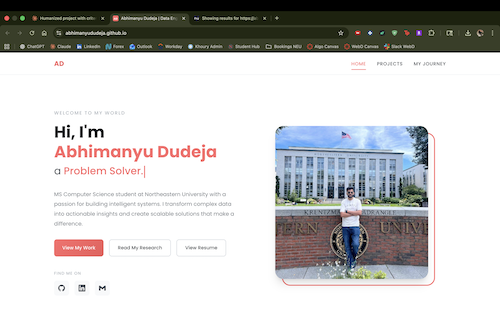

# Abhimanyu Dudeja - Portfolio Website

My personal portfolio website for CS5610 Web Development course.



## Author

**Abhimanyu Dudeja**  
MS Computer Science, Northeastern University  
Email: dudeja.ab@northeastern.edu  
[LinkedIn](https://www.linkedin.com/in/abhimanyududeja/) | [GitHub](https://github.com/abhimanyududeja)

## Class

CS5610 - Web Development  
Northeastern University, Khoury College  
Spring 2025

## Project Objective

Build a personal homepage using vanilla HTML, CSS, and JavaScript (no frameworks or libraries). The site should showcase my background, projects, and skills while meeting all the assignment requirements.

## Live Demo

https://abhimanyududeja.github.io

## Pages

1. **Home** - Introduction with a typing animation effect, my skills, and research highlights
2. **Projects** - My ML and data engineering projects with filter functionality  
3. **My Journey** - Timeline showing my path from Delhi to Boston (AI-generated content)

## How to Run

```bash
# Clone the repo
git clone https://github.com/abhimanyududeja/abhimanyududeja.github.io.git

# Go to folder
cd abhimanyududeja.github.io

# Install dependencies
npm install

# Format code
npm run format

# Check for lint errors
npm run lint

# Start local server
npm start
```

Then open http://localhost:3000 in your browser.

## Project Structure

```
├── index.html          # Homepage
├── projects.html       # Projects page
├── journey.html        # Journey/timeline page
├── css/                # Stylesheets
├── js/                 # JavaScript modules
├── images/             # Images and favicon
├── docs/               # Design document and resume
├── package.json        # Dependencies
└── README.md
```

## Technologies

- HTML5
- CSS3 (Flexbox, Grid, CSS Variables)
- JavaScript ES6+ (Modules, Classes)
- ESLint & Prettier for code quality

## GenAI Disclosure

I used Claude AI (Anthropic) to help with this project:

**What AI helped with:**
- The Journey page content (timeline descriptions and structure)
- Debugging some CSS issues
- Getting started with the typing animation logic

**What I did myself:**
- Overall design decisions and layout
- Writing and organizing the HTML structure
- Styling and making it responsive
- The project filtering functionality
- Testing and deploying to GitHub Pages
- All personal content and information

The AI-generated page is `journey.html` - there's a note on that page indicating it was made with AI assistance.

## License

MIT License
